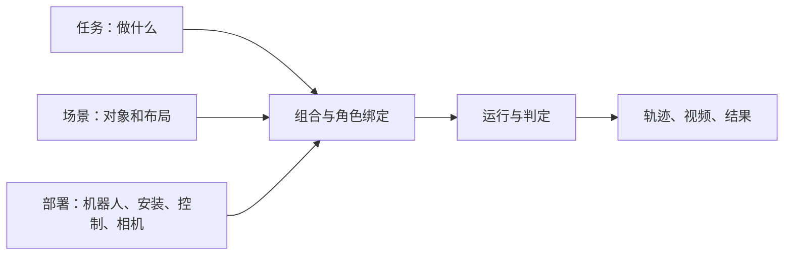

# LOOM-env

面向 context-conditioned VLA 的机器人操作仿真与数据框架，用于研究模型如何利用示范和历史经验。基于 Isaac Lab / Isaac Sim / PhysX，专家使用 cuRobo 规划。

## 当前目标

**独立配置任务、场景和部署，组合成可运行、可复现的案例。**

## 当前进度

- **已具备：** 三类配置与角色绑定、统一执行循环、抓起、放入和直推任务、三路相机记录、采集自动生成视频与重放入口。
- **本体支持：** 六类双臂部署及对应布局；见[本体说明](docs/embodiments.md#抓放录制)。
- **尚缺：** 固定另外两项、只换任务／场景／部署的系统验收。不同本体可能需要调整布局。
- **新增任务：** 盘子推上薄餐垫、纸盒推入可见收纳区，两项固定场景已跑通；完整区域判据与按物体几何调整接触高度，见[运行指南](docs/implementation.md#日常物体推动盘子与纸盒)。积木变体保留为回归。

## 开发入口

- [架构](docs/architecture.md)：职责、执行流程、代码位置。
- [运行](docs/implementation.md)：配置、采集、重放、数据检查；首次使用先[安装环境](docs/environment.md)。
- 扩展：[机器人](docs/embodiments.md) · [场景资产](docs/scene-assets.md)。
- 排查：[运行排查](docs/implementation.md#如何判断与排查)；协作约定：[AGENTS.md](AGENTS.md)。
