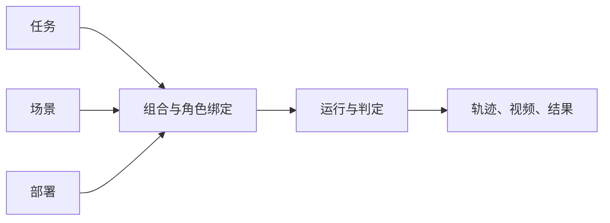

# LOOM-env

面向 context-conditioned VLA 的机器人操作仿真与数据框架，用于研究模型如何利用示范和历史经验。基于 Isaac Lab / Isaac Sim / PhysX，专家使用 cuRobo 规划。

核心做法是把**任务（做什么）、场景（对象和布局）、部署（机器人、安装、控制、相机）**独立配置，再组合成可运行、可复现的案例：

## 当前能力

- **抓放**：抓起积木并抬离支撑面；放入收纳篮；从固定支架中抽出硬币。
- **区域推动**：积木推入目标圆区（含方向与距离变体）；浅盘推上薄餐垫；打开纸盒推入可见收纳标线。
- **工具扫动**：手持刷把物体扫入收纳标线，已覆盖积木、浅盘、鼠标和华夫饼。
- **双臂交接**：按物体包围盒、重力和夹爪尺寸自动生成抓点，无需逐物体标注。
- **关节物体**：固定底座笔记本开盖与半合盖。
- **插入**：硬币从源槽取出后插回目标槽并松手。
- **本体**：六类双臂部署（Panda、Piper、ARX-X5、UR5＋WSG、xArm6＋Robotiq、YAM）。

全部案例见 `configs/collection/`，每个案例做什么和判据是什么写在它引用的 task YAML 里。

## 已知边界

能力范围以实际物理验收为准，以下方向尚未完成：

- **交接**：终点是接收臂在空中独立抓稳。只有平移变体通过现有抓稳判据，转向和换物体变体超时。抓点基于包围盒和重心，不适用于凹形、带把手或软体对象，也不自动重抓。
- **工具扫动**：浅盘物理重放通过，鼠标和华夫饼仍有重放偏差；不覆盖软刷毛、多物体扫动或绕障。
- **插入**：只验证了固定场景 seed 0，多初态成功率未验证；只支持已测量的硬币／支架配对，不是通用孔道几何判定。
- **关节物体**：限定 Panda、固定底座、两个 link、一个活动关节。
- **组合覆盖**：任务／场景／部署的单项替换只在少量代表案例上验证过，且部分证据来自旧版资产。不同本体可能需要调整布局，不能假定同一布局适用于所有本体。
- **实机**：机器人接触参数未按实机标定，相机安装是仿真方案，均未做实物对齐。

## 开发入口

- [运行](docs/running.md)：安装、采集、重放、数据检查。
- [资产接入](docs/assets.md)：物体与本体的来源、质量门槛、扩展方式。
- [架构](docs/architecture.md)：设计原则、配置职责、执行流程、代码位置。
- [拓展规划](docs/expansion-plan.md)：交互类别的推进方向。
- 协作约定：[AGENTS.md](AGENTS.md)。
