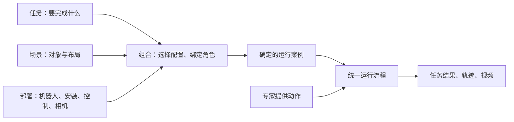

# LOOM-env

为 context-conditioned VLA 研究提供机器人操作仿真、专家轨迹和可复现的运行案例。长期研究目标是检验：示范与历史经验能否帮助模型理解任务、适应部署并执行动作。

**当前重点：让任务、场景和部署能够分别定义、组合与验证。** 采用 Isaac Lab → Isaac Sim → PhysX，专家使用状态机与 cuRobo。研究范围为固定安装双臂，每臂 6 或 7 自由度，夹爪单独描述。

## 项目如何组织



目标结构与职责见[设计说明](docs/architecture.md)。当前组合入口是 [`configs/collection/pick_place.yaml`](configs/collection/pick_place.yaml)：引用三份配置，并指定操作对象与机械臂。

## 当前进度

截至 2026-09-13，以下状态依据已有代码和验收记录；本次文档整理未重跑仿真。

| 部分 | 当前状态 |
| --- | --- |
| 配置与执行 | 已有任务／场景／部署配置、角色绑定、统一 Runner 和独立任务判定；仍需审查耦合并完成交叉验收 |
| 任务与场景 | 抓起、放入容器两个任务；真实桌面、积木和动态篮子，支持布局采样 |
| 本体 | 六类双臂已接入，均有特定布局下的右臂抓放成功记录；范围见[本体验收](docs/embodiments.md#抓放录制) |
| 数据 | 已有 Episode 记录、三路 RGB、完整性检查和物理重放入口；验证范围随记录版本而定 |
| Context 实验 | 配对、训练数据适配与成组策略对照尚未形成闭环，安排在组合基础验收之后 |

**已有抓放成功不等于独立组合已经达标。** 跨本体录制使用了不同布局；当前还缺少系统的单变量切换与不兼容组合检查。

接下来按三步推进：明确现有数据与代码的职责归属 → 整理一个完整运行案例 → 分别换任务、场景、部署并用视频与测量验收。详见[当前计划](docs/architecture.md#当前计划)。

## 开发者从哪里开始

| 想做什么 | 阅读入口 |
| --- | --- |
| 理解原则、结构和代码位置 | [设计说明](docs/architecture.md) |
| 安装环境 | [环境安装](docs/environment.md) |
| 配置案例、采集、重放和查看数据 | [运行指南](docs/implementation.md) |
| 新增机器人或确认本体支持范围 | [本体与资产](docs/embodiments.md) |
| 新增物体或场景 | [场景资产](docs/scene-assets.md) |
| 查看历史测量、失败原因和验收依据 | [任务验证记录](docs/validation.md) |

只检查配置和数据模块，无需 GPU 或仿真资产。先按[基础开发安装](docs/environment.md#基础开发)准备环境，在仓库根目录执行：

```bash
python scripts/inspect_data.py config configs/collection/pick_place.yaml
python -m pytest -q
ruff check .
```

预期配置检查无错误，测试和静态检查通过；这些检查不能代替物理效果验收。完整仿真从[运行指南](docs/implementation.md)开始。

资产与转换产物存放在已忽略的 `.cache/assets/`，轨迹和视频放在 `outputs/`；共享资产目录也可使用。协作约定见 [AGENTS.md](AGENTS.md)。
