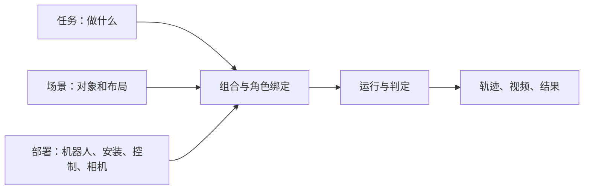

# LOOM-env

面向 context-conditioned VLA 的机器人操作仿真与数据框架，用于研究模型如何利用示范和历史经验。基于 Isaac Lab / Isaac Sim / PhysX，专家使用 cuRobo 规划。

## 当前目标

**独立配置任务、场景和部署，组合成可运行、可复现的案例。**

## 当前进度

- **已具备：** 三类配置与角色绑定、统一执行循环、抓起、放入、直推和双臂交接任务、三路相机记录、采集自动生成视频与重放入口。
- **本体支持：** 六类双臂部署及对应布局；见[本体说明](docs/embodiments.md#抓放录制)。
- **组合验收：** 旧版物理资产下五项代表案例已验证任务／场景／部署替换及左右臂；当前资产已更新，任务效果待复验；见[运行指南](docs/implementation.md#单项替换的组合验收)。尚不覆盖全部本体与任务组合，不同本体可能需要调整布局。
- **双臂交接：** 已接入基于包围盒、重心和夹爪尺寸的自动抓点，无需逐物体交接标注；双 Panda 正反向基线均完成交接但未通过抓稳判据。新增平移、转向和单盒果汁三个变体均完成交接，平移案例通过现有抓稳判据，其余超时；见[变体结果与复现](docs/implementation.md#交接的少量物体与布局变体)。
- **新增任务：** 盘子推上薄餐垫、纸盒推入可见收纳区，两项固定场景已跑通；完整区域判据与按物体几何调整接触高度，见[运行指南](docs/implementation.md#日常物体推动盘子与纸盒)。积木变体保留为回归。
- **工具扫动：** 已覆盖积木、浅盘、鼠标和华夫饼的固定案例；新增三类物体均完成入区与工具抬起，收尾按实测工具离桌高度反馈。浅盘物理重放通过，鼠标和华夫饼仍有重放偏差；见[结果与复现](docs/implementation.md#持工具扫物体入区域)。

- **硬币插入：** 固定场景 seed 0 已完成取出、持币插入与释放，按“插进目标槽并松手留下”的判据通过实测与离线复核；多初态成功率尚未验证。见[运行与验证记录](docs/implementation.md#硬币插回固定槽)。

## 开发入口

- [架构](docs/architecture.md)：职责、执行流程、代码位置。
- [运行](docs/implementation.md)：配置、采集、重放、数据检查；首次使用先[安装环境](docs/environment.md)。
- 扩展：[机器人](docs/embodiments.md) · [场景资产](docs/scene-assets.md)。
- 排查：[运行排查](docs/implementation.md#如何判断与排查)；协作约定：[AGENTS.md](AGENTS.md)。
