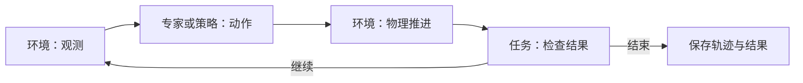

# 架构

## 原则

一份事实只定义一次；任务目标与执行方法分开；采样规则与实际初态分开；已有能力用配置组合，新行为用 Python 实现。

## 配置职责

| 部分 | 定义什么 | 当前入口 |
| --- | --- | --- |
| 资产 | 模型、物理属性、功能区域；本体关节与夹爪定义 | `assets/`、`embodiments/` |
| 场景 | 对象实例、布局、环境条件与采样范围 | `configs/scenes/` |
| 部署 | 本体选择、安装、初始姿态、控制与相机 | `configs/deployments/` |
| 任务 | 对象角色、前置条件、完成与失败判据 | `configs/tasks/`、`tasks/` |
| 组合 | 引用三份配置，绑定对象与操作臂 | `configs/collection/` |

例如[放入任务的组合配置](../configs/collection/pick_place.yaml)把任务角色 `target_object` 绑定到场景实例 `object`，把 `manipulator` 绑定到右臂。换目标只改绑定，换布局改场景，换安装改部署；新增判据或动作流程需要对应代码。

组合经采样与检查后，保存确定的配置和实际初态，形成可复现的运行案例。位姿必须注明参考坐标系；不兼容组合应说明原因，不能隐式修改其他配置。

这是目标边界。当前已有配置拆分，但通用前置条件尚未实现，本体固定参数仍部分写在部署中。

抓持接触证据只来自目标物体上的实测双指接触力，不使用夹爪开度、开度占行程比例或夹爪命令推断。双指相向接触不等于已经抓稳；任务还需用真实抬升、持物和释放过程验收。

## 执行职责

Runner 协调下面的循环与记录。环境持有物理状态，专家组合动作，动作持有自身执行进度，任务检查器持有判定进度。

环境负责创建实体和重置初态；执行器只提供动作；任务判据独立于专家。数据保留输入动作、测量状态、时间戳与配置，规划成功不能代替实际任务成功。

交接任务用 `giver`／`receiver` 绑定不同操作臂。专家在重置时依据物体包围盒最长轴、USD 经仿真计算的重心以及本体夹爪尺寸，生成重心两侧的一对抓点；不读取逐物体交接标注。当前采用双 Panda 从上方夹持的单一几何规则，不含候选搜索或重抓。组装入口为它创建两个单臂规划器，专家按物理反馈依次协调两臂；任务检查器从接触与物体位姿历史判断交接，不读取专家阶段。专家的 `close()` 释放其拥有的规划器，采集入口无需知道规划器数量。专家仍实现统一 `ActionSource.reset/act`；尚未引入通用技能状态机或动作流程配置语言。

## 代码入口

工具扫动用 `tool`、`target_object`、`target_region` 绑定三个实体。`SweepExpert` 的单臂规划器抓持并携带工具，目标积木仅在接触阶段允许碰撞；任务检查器复用完整区域与防抬升／倾倒判据，并要求实测工具接触和最终抬起。环境对动态物体之间记录具名接触力，不从任务角色决定传感器。流程和物理限制见[扫动运行指南](implementation.md#持工具扫物体入区域)。

以下路径相对 [`src/loom_env/`](../src/loom_env)：

| 要改什么 | 从哪里看 |
| --- | --- |
| 配置解析与协议 | `specs/config.py`、`specs/episode.py` |
| 资产、本体、布局 | `assets/`、`embodiments/`、`scenes/` |
| 物理执行与观测 | `environments/isaac_lab.py` |
| 任务判据、专家行为 | `tasks/`、`experts/` |
| 组件组装、执行循环 | `runtime/build.py`、`runtime/runner.py`；接口在 `runtime/protocols.py` |
| 轨迹读写与校验 | `data/`，可独立于仿真使用 |

命令入口在 `scripts/`，依赖在 `pyproject.toml`。随[任务与场景拓展](expansion-plan.md)按具体案例检查组装入口的角色假设和部署与本体定义的重复；进度统一见 [README](../README.md#当前进度)。

Expert 是完整示范的执行策略，现有类名不是一套交互能力分类。具体任务可以复用同一个入口；`runtime/build.py` 不按物体资产 ID 特殊分派。全部七个 expert（Lift、PickPlace、Insertion、Push、Sweep、Handover、Articulation）在普通 Python `routine()` 中组合反馈动作，共用 `ActionExpert.reset/act/close`；没有保留逐 expert 的阶段执行器。

`experts/actions.py` 中的 `Grasp` 只负责接近并建立抓持，`MoveHeld` 负责已有抓持下的规划运动，`Extract` 负责沿给定退出轴的持物运动，`Release` 负责松开并观察释放；`Move` 提供不要求持物的规划运动。插入特有的对齐与进入控制是 `experts/insertion.py::Insert`，可以从入口附近的已有抓持状态独立开始，不负责取物和搬运。完整的 `InsertionExpert` 负责按初态选择准备动作，然后组合这些操作。动作完成只允许流程继续，不代表任务成功。

动作使用显式的 `Manipulator` 状态／命令缓冲区，依赖当前观测、物体状态和规划器，不读取任务 ID 或完整流程的阶段编号。每个控制周期先 `update(observation, world)`，再调用当前动作的 `step(arm)`；它返回是否完成，失败抛出 `SourceFailure`。`ActionExpert` 只推进 Python 生成器、汇总命令及事件，没有动作注册表或流程配置语言。采集者仍使用原有的一步 `collect.py` 入口。

Push 与 Sweep 共用 `PushContact`，区别由速度、侧向修正、接触物体和持工具要求表达。Handover 依次切换同一执行器中的活动手，两手共享命令缓冲区，分别使用自身规划器；`holding` 指定当前必须保持真实抓持的手。接收手连续抓稳后，才进入递出手释放。Articulation 组合 `Move`、`CloseGripper`、`MoveJoint`、`Release`；关节类型只描述运动约束，`MoveJoint` 可以从已有活动 link 抓持独立开始。当前范围、接口示例、验证结果和运行命令集中在[共享动作重构](implementation.md#共享动作重构)。

资产目录只标注交互几何：抓取点及可选局部朝向、圆柱配合特征、槽入口坐标系、活动 link 的接触坐标系。质量、材质、碰撞和关节仍只来自 USD。任务定义目标、过程限制和验收；专家负责执行选择；任务判据独立读取测量历史。关节流程的接触选择沿用现有 `contact_index` 参数；这轮迁移执行架构，不修改任务配置协议。插入控制与判据共用 `assets/insertion.py` 的几何计算，插入专家不实例化任务检查器。

开盖与半合盖共用 `ArticulationExpert` 和 `ArticulationTask`。关节运动取 USD 的类型、轴、父坐标系和限位；旋转用弧度，滑动用米。当前控制流程为抓持后运动并释放，仍限定 Panda、固定底座、两个 link 和一个活动关节。插入目前支持圆片状圆柱与槽，不能把接口泛化当作任意插销／螺纹插入已经验证。真实仿真覆盖范围、命令及证据集中在[能力边界重构](implementation.md#expert-能力边界重构)。
