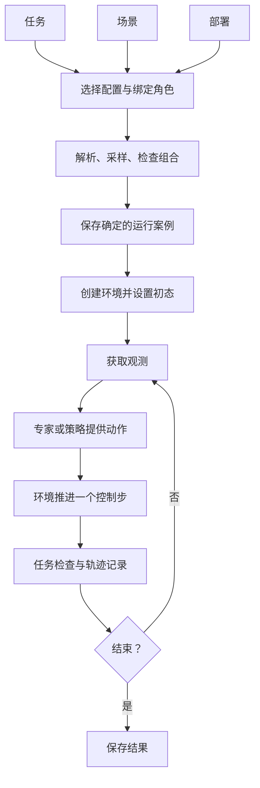

# 设计说明

[返回项目入口](../README.md) · [运行指南](implementation.md)

本文说明已确定的设计方向和当前代码位置，不表示所有边界已经实现或验收。当前目标是：组合一个任务、一个场景和一个部署，运行并判断结果；更换其中一项时，其余项的定义保持不变。

## 四条原则

1. **一份事实只有一个归属。** 尺寸与物理属性属于资产，物体布局属于场景，机器人安装属于部署，完成条件属于任务。
2. **目标与方法分开。** 任务定义完成条件，专家或策略决定如何完成；换执行方法不改变判据。
3. **生成规则与运行结果分开。** 配置描述候选和采样范围，运行案例保存实际选择与初态；复现使用确定结果。
4. **按实际变化增加接口。** 已有能力用配置组合，新行为用 Python 实现；用具体案例检验边界，再提取复用部分。

## 五个核心概念

| 概念 | 负责的内容 | 示例 |
| --- | --- | --- |
| 资产 | 模型、物理属性、必要功能信息 | 积木几何、篮子内腔、机器人关节与夹爪定义 |
| 场景 | 资产实例、布局、环境条件与初态采样 | 桌子、两块积木和篮子，物体相对桌面摆放 |
| 部署 | 本体选择、安装、初始姿态、控制与相机 | 双 Panda、关节位置控制、前视和腕相机 |
| 任务 | 对象角色、前置条件、完成与失败判据 | 把目标物放入容器并释放 |
| 运行案例 | 任务／场景／部署选择、角色绑定、确定初态 | 操作红色积木、放入篮子、使用右臂 |

场景实例与任务角色通过组合入口绑定。任务访问 `target_object`，不依赖具体实例名；场景不决定本次操作哪个对象。任务需要的初始关系由任务声明，在组合时检查或用于约束采样；通用前置条件机制仍待实现。

独立定义不保证任意组合都可执行。缺少容器功能区域、夹爪不适配、目标不可达等情况应有具体原因；不得通过隐式修改场景或成功条件让组合通过。所有位姿必须明确参考坐标系，初版围绕世界、工作区和机器人连杆表达。

## 一条运行流程



- **环境**持有物理状态，执行动作并提供观测。
- **执行器**持有专家阶段或策略状态，只提供动作。
- **任务检查器**持有判定进度，计算完成与失败。
- **Runner**协调时间、调用顺序、终止和记录，不包含具体抓取方法或任务判据。

场景实体创建与初态重置属于运行时内部职责。物理初态需经过稳定化和验收，接受后的实际状态进入运行案例。配置可检查不等于物理可执行，规划成功也不等于任务成功。

## 配置如何使用和扩展

用户主要维护三份定义和一个组合入口。当前已有入口如下，可直接用于现有采集命令：

```yaml
# configs/collection/pick_place.yaml
task: ../tasks/put_object_in_container.yaml
deployment: ../deployments/dual_panda.yaml
scene: ../scenes/tabletop.yaml
role_bindings:
  target_object: object
  container: basket
arm_roles:
  manipulator: right
max_steps: 500
```

以上名称沿用当前实现；“运行案例”是设计概念，目前对应 collection 的组合、`EpisodeSpec` 及实际初态记录，不要求新增 `run.yaml` 或新类。

本体固定信息应共用定义。安装、控制与相机可以保留在同一 deployment 中，有实际复用需求时再提取预设；不预先增加配置继承层级。

| 扩展内容 | 应修改的部分 |
| --- | --- |
| 换目标对象或操作臂 | 组合入口的角色绑定 |
| 换布局、采样范围或已有资产 | 场景配置 |
| 换安装、控制或相机 | 部署配置；新控制类型需对应实现 |
| 新资产或本体 | 固定来源、功能／接口定义、必要适配与物理验收 |
| 新任务参数 | 已有任务配置 |
| 新完成条件或时序行为 | 任务 Python 实现与注册 |
| 新执行方法 | 专家或策略动作源实现与组装 |

## 当前代码地图

下面是已有目录，不是待创建的框架。安装依赖集中在 `pyproject.toml`；采集、重放和检查入口位于 `scripts/`。

| 代码入口 | 当前职责 |
| --- | --- |
| [`specs/`](../src/loom_env/specs) | 配置解析、校验、Episode 数据约定 |
| [`assets/`](../src/loom_env/assets) | 场景资产目录与准备 |
| [`embodiments/`](../src/loom_env/embodiments) | 本体资产、关节与夹爪、抓取适配、相机 |
| [`scenes/`](../src/loom_env/scenes) | 工作区采样、资产实例构建 |
| [`environments/isaac_lab.py`](../src/loom_env/environments/isaac_lab.py) | 物理环境、观测、接触、初态与恢复 |
| [`tasks/`](../src/loom_env/tasks) | 抓起和放入判定；任务工厂 |
| [`experts/`](../src/loom_env/experts) | 抓放状态机与 cuRobo 规划 |
| [`runtime/build.py`](../src/loom_env/runtime/build.py) | 组装环境与专家 |
| [`runtime/runner.py`](../src/loom_env/runtime/runner.py) | 共用控制循环；接口位于同目录 `protocols.py` |
| [`data/`](../src/loom_env/data) | 无需仿真依赖的轨迹读写、校验与索引 |

已有结构接近目标，但仍有待整理的边界：部署文件内包含本体固定参数；专家组装按任务 ID 选择，并假定抓放角色；场景功能与初态条件主要服务于现有桌面任务。应先检查实际归属，再做局部调整。

## 当前计划

| 阶段 | 工作 | 完成依据 |
| --- | --- | --- |
| 1. 确定边界 | 用现有抓起／放入案例列清事实归属，审查重复与跨模块假设 | 一份明确的案例和最小代码调整清单 |
| 2. 整理一个组合 | 贯通配置、初态、执行、判定与记录，落实必要边界 | 可运行命令、确定配置、视频与测量一致 |
| 3. 逐个改变维度 | 固定另外两项，分别换任务、场景、部署；检查不兼容组合 | 变更范围可追踪，错误原因具体，扩展不修改无关模块 |

文档原则与结构已确定；代码审查、边界调整和系统交叉验收尚待推进。已有跨本体抓放采用不同场景，不能直接算作第三阶段完成。当前能力和证据入口统一见 [README](../README.md#当前进度)。

## 后续研究方向

组合基础验收后，再构造目标示范、部署校准、跨本体、历史和失败恢复 Context，逐步接入人类视频与真机数据。训练系统可独立于仿真，使用 Episode 数据接口；策略接入同一个 Runner。

实验保留三项约束：按来源划分数据再配对；历史只使用当前时刻之前的信息；模型输入与仿真真值分开。在相同测试初态下比较正确、无、错误 Context 和模态消融，报告任务结果与重复实验的不确定性。模型增益属于实验结论，平台验收关注实验能否可靠复现。
