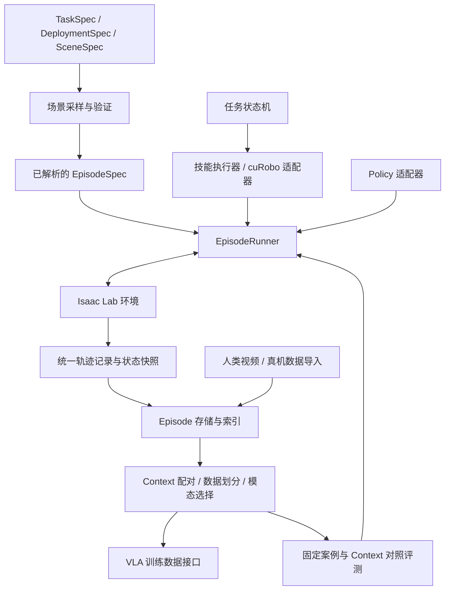

# LOOM-env 架构设计

状态：架构设计与分阶段计划。阶段 A 的配置、Runner、任务检查与离线数据基础已实现并通过自动化测试；已增加真实双 Panda 关节运动诊断和视频导出，抓取放置仿真闭环尚未验证。详见 [当前实现](implementation.md)。

更新日期：2026-09-08。实际安装版本与验证结果见 [环境文档](environment.md)。

总体方案：**一个 Python 包，以配置组合任务、场景和部署；专家与 Policy 共用一个 Runner；以 Episode 协议连接仿真生产与 Context 实验。** 本体统一采用双臂，每臂 6 或 7 自由度；先实现一种双臂本体、单任务闭环，再用第二种本体和任务检验扩展边界。

## 1. 目标与已确定的技术路线

LOOM-env 为 context-conditioned VLA 研究提供可控的仿真环境、专家轨迹、数据配对和对照评测。核心研究问题是：将不同来源、不同模态的轨迹作为上下文，能否改善模型对当前动作的预测和任务执行。

已确定的路线：

- 仿真底座使用 **Isaac Lab → Isaac Sim → PhysX**。
- 本体统一采用 **双臂，每臂 6 或 7 个机械臂关节自由度**；夹爪自由度与控制量单独描述。首批覆盖双 6 自由度和双 7 自由度本体。
- 专家轨迹使用 **任务状态机 + cuRobo 运动规划 + 仿真闭环执行与验收**。
- 建立独立项目，直接扩展 Isaac Lab 的原生接口；按需迁入其他项目的资产、任务设计和工具。
- 通用仿真与轨迹生产、Context 实验分别组织，共用一套 Episode 数据协议。

cuRobo 负责运动学、碰撞检查和运动规划。抓取哪个物体、采用哪个抓取位姿、何时开合夹爪、如何完成接触操作以及失败后如何重试，由任务专家和执行器负责。规划成功与任务成功分别记录。

双臂本体范围已确定。第一版暂按固定基座、桌面操作设计，操作刚体及抽屉、柜门等关节物体；安装形式和首批对象范围仍待确定。移动底盘、可动躯干等额外运动组在有具体需求时再接入。人类视频和真机轨迹通过数据导入接口参与 Context 实验；仿真平台本身不替代这些数据的真实采集。

## 2. 支持的 Context 实验

| 模式 | Context | Query / 目标轨迹 | 主要验证内容 |
| --- | --- | --- | --- |
| 目标任务示范 | 目标任务的一条成功示范 | 同任务、独立初始化的其他轨迹 | 从示范理解目标和执行方式；分别评测已见与未见任务 |
| 本体与部署适应 | 当前部署设置下的校准任务 | 相同部署设置下的其他任务 | 从示范适应机器人、安装方式、相机和控制模式 |
| 跨机器人迁移 | 来源机器人完成某任务的示范 | 目标机器人完成相同语义目标 | 跨本体任务迁移 |
| 人到机器人 | 人手完成目标任务的视频 | 机器人完成相同语义目标 | 从人类演示理解任务 |
| 失败避免／恢复 | 有明确原因或事件标注的失败轨迹 | 再次尝试的成功轨迹，或从失败现场继续的恢复轨迹 | 区分学习避免失败与实际状态恢复 |
| 历史记忆 | 当前 episode 在时刻 t 之前的轨迹 | 当前观测对应的后续动作 | 在当前观测不足以确定正确动作时利用历史 |
| 仿真到真实 | 仿真中的目标任务示范 | 对应部署设置下的真机轨迹 | 仿真上下文对真实执行的帮助 |

各模式可以组合，指令、图像、动作等模态可以按实验配置选用。零 Context 对应当前视觉、机器人状态和任务指令输入的基线。

研究假设是正确 Context 带来可测量的增益，不预设所有任务在无 Context 时都必须失败。长任务是否需要记忆，要由任务中的信息依赖决定。

## 3. 总体结构

### 3.1 设计原则

1. **直接复用 Isaac Lab。** 动作、观测、传感器和物理步进沿用原生机制，LOOM-env 补充任务语义、专家生成、Episode 数据和 Context 实验。
2. **用组合表达变化。** 任务定义目标，场景定义对象与布局，部署定义机器人、控制器和相机；通过配置组合，通用任务逻辑按对象角色和机器人能力访问实例。
3. **只保留一个执行循环。** 专家和 Policy 都逐控制周期提供动作；Runner 调度，环境执行，任务检查器判定，Recorder 记录。
4. **在变化点设置小接口。** 优先使用配置、普通函数和少量 `Protocol`；技能先用显式状态机，有实际复用后再抽公共逻辑。
5. **数据可独立使用。** Episode 读取、Context 配对和数据导出可以在未安装 Isaac Sim、cuRobo 的机器上运行。

首版保持单仓库、单 Python 包和本地文件存储。多仿真后端、通用插件系统、任务 DSL、分布式调度服务在出现具体需求后再设计。

### 3.2 执行与数据流



图中的执行器产生控制动作，环境负责唯一的物理步进和观测更新。数据记录挂接在统一生命周期中。专家和 Policy 使用相同的执行、记录及成功判定链路。

Context 模块通过轨迹引用和元数据组织实验。训练框架通过数据适配器读取样本，模型服务通过 Policy 适配器接入评测。

### 3.3 模块边界与依赖

以下五组是职责划分，均位于同一个进程或 Python 包内；具体目录见第 10 节。

| 职责 | 模块 | 负责的内容 | 主要输出 |
| --- | --- | --- | --- |
| 协议 | `specs` | 配置、动作／观测描述、Episode 和 Context 的可序列化结构及校验 | 稳定的数据约定 |
| 内容定义 | `assets`、`scenes`、`embodiments`、`tasks` | 资产目录、布局采样、部署配置、任务目标及状态更新 | 配置、采样结果、任务检查器 |
| 执行 | `runtime`、`experts` | 环境组装、回合调度、快照、专家状态机、规划和轨迹跟踪 | 动作、状态、任务结果 |
| 数据 | `data` | Episode 写入、读取、索引、外部数据导入和格式导出 | 可独立读取的 Episode |
| 实验 | `contexts`、`evaluation` | 划分与配对、模型输入选择、Policy 适配、固定案例评测 | 训练样本和评测结果 |

依赖规则：

- `specs` 是底层协议；`data` 只依赖协议和存储库；`contexts` 依赖 `specs`、`data`。这三个模块均不导入仿真或规划库。
- `runtime` 组装内容定义并调用 `data` 写入。Isaac Lab 的 Recorder 钩子放在 `runtime/recording.py`，文件格式实现放在 `data/`。
- `runtime/protocols.py` 只定义执行接口，不导入 Isaac Lab。`experts` 和 Policy 适配器实现其中的动作源接口；`runner.py` 接收动作源实例，无需导入具体专家或模型。
- `evaluation` 组合 `contexts`、Policy 和 Runner；具体对象由入口脚本显式创建并传入。任务定义不导入专家或模型；内容定义与运行时均不依赖具体 Context 实验。
- Isaac Lab 配置转换集中在运行时组装入口，cuRobo 调用集中在专家适配器。包入口保持轻量，仿真相关导入在应用启动后进行。

对象的状态归属也固定：配置由 `specs` 描述，物理状态由环境持有，任务进度由任务实例持有，技能进度和规划缓存由专家持有，episode 时钟与结束流程由 Runner 持有。快照协调保存这些状态，避免多处维护同一份可变状态。

## 4. 核心配置与数据对象

| 对象 | 内容 | 示例 |
| --- | --- | --- |
| `TaskSpec` | 语义任务 ID、对象角色、操作角色与能力要求、成功／失败条件、任务参数与初始逻辑状态 | 将 `target_object` 放入 `container` |
| `DeploymentSpec` | 双臂模型、各臂关节与末端映射、夹爪、安装变换、控制器、统一控制频率、相机配置 | 双 7 自由度本体 + 两个夹爪 + 前视与双腕相机 |
| `SceneSpec` | 场景模板、资产候选、布局约束、物理及视觉随机化分布 | 物体位于桌面可达区域、初始不相交 |
| `EpisodeSpec` | 一次运行已确定的资产、初始状态、部署配置、随机化参数、随机种子及版本 | 某个具体杯子、盒子、位姿和光照设置 |
| `ContextSpec` | 轨迹引用、时间范围、来源关系、模态可见性和模式文本 | 使用一条同部署设置的校准轨迹，只提供图像和动作 |

`SceneSpec` 表示怎样采样，`EpisodeSpec` 表示实际采样出了什么。Episode 保存展开后的配置与资产版本，避免只靠 seed 重建场景。

配置采用 YAML 预设加显式引用，加载为带类型的数据对象并校验；行为用 Python 实现。运行前检查角色是否绑定、部署是否具备所需能力、动作维度与坐标系是否匹配、资产版本是否可用。采样和稳定性检查期间保留候选配置；将验收后的实际初态写入 `EpisodeSpec`，冻结后开始记录。运行中的任务状态单独保存，不修改 `TaskSpec`。

部署设置内部继续分开双臂模型、各臂安装位姿、控制器和传感器。相机变化、安装变化、控制变化与机器人形态变化分别打标签，实验可以选择单因素或组合变化。

任务 ID 和参数变体需要显式定义。例如只改变物体位置属于 episode 变化，是否将更换目标物体或目标关系视为新任务，由数据划分协议声明。

下面是配置组织示意，字段仍需在实现前细化：

```yaml
task:
  id: put_object_in_container
  roles:
    target_object: graspable_object
    container: receptacle
  required_capabilities: [grasp, place]
  success:
    - inside: [target_object, container]
    - released: [target_object]

deployment:
  robot: dual_arm_7dof          # 示意预设：定义 left / right 的模型与映射
  mount: tabletop_dual_arm
  controller: joint_position
  sensors: front_and_both_wrists

scene:
  template: tabletop
  constraints: [supported, no_initial_overlap, reachable]
  randomization: tabletop_default

expert:
  type: state_machine
  skill: pick_and_place
  arm_roles:
    manipulator: right        # 技能按角色访问；另一臂保持指定目标
  planner: curobo
  planning_mode: one_arm_with_other_held
```

示例中的预设名称仅用于说明配置结构，示例配置暂采用双 Panda，机器人型号与实际安装仍待确认和仿真验证。专家将 `manipulator`、`support` 等操作角色绑定到 `left` / `right`；绑定可由配置指定或根据可达性选择，解析结果写入 Episode 元数据。任务声明角色所需能力和协作关系。

任务目标可以通过小规模的谓词库表达，如 `inside`、`on_top`、`released`、`drawer_open`。复杂的时序条件和接触行为通过 Python 扩展，不要求第一版实现完整任务描述语言。

## 5. 资产、场景生成与部署适配

### 5.1 资产目录

资产条目记录可视模型、碰撞模型、尺度、质量与摩擦参数、关节信息，以及抓取候选、接触点、支撑区域、容器内部区域等功能标注。标注使用明确的局部坐标系，并记录资产来源与版本。

场景生成流程：

1. 根据任务对象角色和部署能力选取兼容资产。
2. 按布局约束采样位置、朝向和物理／视觉参数。
3. 检查初始穿插、支撑关系与各臂工作空间。按操作角色检查可达性；交接、共同搬运等任务额外检查双臂重叠工作区及臂间碰撞。
4. 执行有限的稳定性检查，以及需要的 IK／碰撞检查。
5. 输出已解析的 `EpisodeSpec`，记录采样失败与拒绝原因。

这些检查用于筛除明显无效的场景；任务可完成性仍通过专家在仿真中的执行验证。各阶段设置尝试上限，避免无界重采样。

### 5.2 机器人与动作协议

一套双臂本体是一个部署实例，固定使用 `left`、`right` 作为臂标识。每臂描述机械臂关节名及顺序、自由度、关节限制、TCP、夹爪控制映射和安装变换；相机使用明确的前视／左腕／右腕名称。标识由部署定义，不随相机视角改变。

仿真模型可由一个多分支 articulation 或两个 articulation 表达，映射由本体配置和运行时适配器处理。任务、专家和数据协议始终访问同一套逻辑双臂接口。

所有动作描述必须声明：控制类型、各臂字段与展开顺序、维度、单位、绝对／增量语义、参考坐标系、旋转表示及组合方式、控制周期，以及归一化和裁剪规则。双臂动作按 `left`、`right` 分组，每组包含 `arm` 和 `gripper`；进入 Isaac Lab 动作张量时由描述确定各字段切片。机械臂关节自由度、夹爪物理关节数和夹爪控制量维度分别记录。

以下维度示例假设每个夹爪用一个标量控制：

| 控制表示 | 双 6 自由度本体 | 双 7 自由度本体 |
| --- | --- | --- |
| 关节位置动作 | 每臂 6 + 夹爪 1，共 14 维 | 每臂 7 + 夹爪 1，共 16 维 |
| TCP 增量动作：平移 3 + 旋转向量 3 + 夹爪 1 | 每臂 7，共 14 维 | 每臂 7，共 14 维 |

TCP 动作维度相同不代表关节空间、可达范围或控制响应相同。每臂 TCP、机械臂基座和机器人公共参考系到 `world` 的变换均需明确记录；相对位姿目标还需声明参考臂及参考末端。

每个控制周期同时提交两臂动作，再进行一次环境步进。未运动臂仍下发明确的保持目标并记录其状态。首版双臂使用共同控制周期；action chunk 在适配器内按同一时间轴展开。

数据分别保存策略／专家的输入动作、处理后下发的控制目标和两臂测量状态。原始数据保留每臂实际关节维度；跨本体批处理所需的补齐和有效性 mask 在数据适配层生成。跨本体学习使用的统一动作表示也在该层生成，同时保留原生动作。是否统一控制语义属于实验变量。

## 6. cuRobo 专家轨迹生成

专家链路采用如下职责划分：

```text
任务状态机
    ↓ 选择当前技能、对象和结束条件
技能执行器
    ↓ 产生抓取候选、目标位姿和运动约束
cuRobo 适配器
    ↓ 根据当前机器人状态与碰撞世界规划运动
控制适配器
    ↓ 按环境控制周期执行轨迹
仿真观测与任务检查
    └─ 更新状态机 / 继续执行 / 重规划 / 结束并标注结果
```

抓取放置专家可以包含：选择抓取位姿 → 接近 → 闭合夹爪 → 确认抓取 → 抬升 → 搬运 → 放置 → 释放 → 撤离 → 检查任务目标。

接口边界：

- **任务状态机**保存技能进度、尝试次数及恢复状态；任务成功由独立的任务检查器计算。
- **技能执行器**管理前置条件、完成条件和超时；物体滑落、抓取失败等通过仿真反馈发现。
- **cuRobo 适配器**管理双臂规划配置、各臂关节和坐标映射、碰撞世界同步、臂间碰撞、被抓物体的碰撞处理及规划结果。
- **控制适配器**将规划输出转换为指定控制模式的命令，执行插值／重采样并监测跟踪误差。
- **EpisodeRunner**统一推进仿真、更新时间、记录动作和观测、调用终止逻辑。

双臂规划保留两种明确模式，均输出两臂在共同时间轴上的控制目标：

- **一臂运动、另一臂保持**：用于首版到达与抓取放置。保持臂及其夹持物进入碰撞检查，执行时监测保持误差；其状态变化后使原计划失效。
- **双臂协同运动**：规划输入包含两臂当前状态、各自目标、同步条件及必要的末端相对位姿约束。候选轨迹必须在同一时间轴上检查全机器人自碰撞、臂间碰撞和环境碰撞。规划适配器声明所支持的协同约束；具体 cuRobo 接入和可用性在阶段 A／B 验证，不支持时返回明确原因。独立规划两条轨迹不能直接作为可执行的双臂联合计划。

交接和共同夹持额外维护物体的抓持状态：`free / left / right / both`。状态机通过接触、夹爪和物体运动反馈确认抓取与释放，只有满足接收条件后才让交出臂松开。规划世界中的物体身份保持唯一，并根据阶段更新允许接触的链接对；共同夹持阶段还需检查相对位姿与物体稳定性。

抓住物体后的规划碰撞模型需要反映被携带物体。该表示服务于规划，实际物体在仿真中仍通过接触和夹持运动，并检查是否滑落。

开抽屉、插接等技能需要额外的接触执行逻辑。cuRobo 的无碰撞到达轨迹不能单独作为接触任务完成的证据。

规划失败、执行失败和任务失败分别标注。重试和重规划有明确预算；批量生成也记录全部尝试，便于计算有效成功率与吞吐量。将 cuRobo API 隔离在适配器中，并固定与 Isaac Lab、Isaac Sim 共同验证过的版本组合。

## 7. 环境运行与状态恢复

运行时优先使用 Isaac Lab 原生 Manager-based 动作、观测、事件和记录接口。新增封装集中在任务状态、场景实例化、运行调度与数据协议。

### 7.1 环境与回合生命周期

生命周期明确区分：

| 操作 | 用途 |
| --- | --- |
| `build / reconfigure` | 更换机器人拓扑、物体模型、传感器结构等需要重建的内容 |
| `reset_episode` | 在兼容的场景结构中改变位姿、关节状态和已支持的随机化参数 |
| `snapshot / restore` | 保存或恢复某个时刻，用于重放、分支和失败恢复 |

首版选择 **`ManagerBasedEnv` + 显式回合结束与重置**：原生环境负责动作、物理子步和观测更新；LOOM-env 的任务检查器提供成功／失败结果，Runner 管理超时和结束流程。基础环境与 RL 环境的职责差异可参照 [Isaac Lab 环境 API](https://isaac-sim.github.io/IsaacLab/main/source/api/lab/isaaclab.envs.html#manager-based-environment)，具体接入以第 13 节的本地源码为依据。

本地 `ManagerBasedRLEnv.step()` 会在终止后自动重置环境。如果后续接入 RL 训练，再增加独立适配，并利用终止前／重置前钩子保存末帧。首版不复制其内部物理循环。

### 7.2 最小执行接口

以下是拟定的逻辑接口，类型名称用于明确边界，具体签名在阶段 A 验证。

| 接口 | 约定 |
| --- | --- |
| `ActionSource.reset(episode_input)` / `act(observation) → action` | 专家和 Policy 共用；每次 `act` 同时产生两臂在一个控制周期内的动作，长轨迹或 action chunk 在适配器内部缓存 |
| `Task.reset(initial_state)` / `update(world_state, dt) → TaskStatus` | 按控制周期更新任务进度，返回成功、失败及原因；不发出动作 |
| `Environment.reset_episode(spec)` / `step(action) → Transition` | 运行时薄封装，组装并调用 Isaac Lab 原生环境；`step` 不自动重置 |
| `EpisodeWriter(root, spec)` / `begin(initial)` / `append(...)` / `finish(outcome)` | 唯一的写盘入口；`finish` 补齐结果、验收并提交一次 |
| `snapshot()` / `restore(snapshot)` | 由运行时协调环境、任务、动作源和时钟；仅支持兼容的场景结构与已声明可恢复的组件 |

`episode_input` 只含模型可见的任务指令、动作／观测描述及选定 Context，不直接传入完整 `EpisodeSpec`。专家额外获得只读的场景真值与规划服务；Policy 的输入选择器不暴露这些字段。技能与规划器仅返回动作或规划结果，不自行调用 `env.step()`。

一次回合按以下顺序执行：

```text
解析配置 → 采样与验证 → build / reset → 稳定性检查 → 冻结 EpisodeSpec
  → 初始化任务与动作源 → 保存 observation_0 与初始状态
  → 循环：动作源给出 action_t
           → env.step(action_t)，返回控制目标与 observation_t+1，由 Runner 统一记录
           → Task.update，Runner 判断继续 / 成功 / 失败 / 超时
  → 保存终止状态与结果 → 校验并提交 Episode → reset 或 close
```

当前 Runner 在每次环境控制步之后，将输入动作、处理后目标和末帧交给 `EpisodeWriter` 一次。后续 Isaac Lab 记录桥接负责通过原生钩子获得控制目标与观测，不增加第二条写盘路径。原生 Recorder 默认的 reset 和 close 导出应关闭，由 LOOM 的独立任务判据与显式 `finish` 提交轨迹。本地 `record_pre_reset()` 默认从 `termination_manager` 取成功标记，基础环境没有该管理器；不能把这一默认行为当作任务验收。具体钩子顺序仍需在真实仿真中验证。

专家重试耗尽、策略调用失败、数据写入失败都返回结构化原因；已经发生的任务交互尽量保留。未通过完整性检查的文件不发布到有效 Episode 索引，失败尝试另有运行日志。初始化阶段的稳定化步进不计入轨迹。

### 7.3 状态恢复

快照应覆盖可获取的物理实体状态、两臂及夹爪的控制器目标与内部状态、任务状态、专家状态、随机数状态、episode 时钟和必要的观测历史。双臂协同还需保存操作角色绑定、共同轨迹的执行位置、抓持状态及阶段性接触规则。记录场景及运行版本，并用相同后续动作比较恢复前后的误差。

恢复前检查配置与组件版本；重建规划碰撞世界并使旧计划失效，再从恢复的观测继续。严格动作重放直接使用已记录动作；恢复后重规划属于一次新的分支执行。若 Policy 具有无法保存的远程会话或隐状态，只声明支持物理状态恢复，并记录其重新初始化方式。

可恢复状态不等同于物理引擎内部求解器状态的逐位复原。对接触场景建立允许的恢复误差和验收标准。

失败数据分为：

- **失败避免**：失败示范与后续独立尝试共享相关任务条件或失败原因。
- **失败恢复**：目标轨迹从失败 episode 的明确分支时刻与状态继续。

恢复 episode 记录 `parent_episode_id`、`branch_step` 和快照引用。无效场景、运行异常与可用于学习的任务失败分别组织。

## 8. Episode 数据、记录与导出

一次 episode 的逻辑结构：

```text
Episode
├── id / schema_version
├── resolved_specs / asset_versions / runtime_versions
├── observations / timestamps
├── input_actions / applied_control_targets
├── measured_robot_states
├── task_events / skill_segments / outcome
├── snapshots
└── provenance / parent_episode_id / source_demo_id
```

记录要求：

- 明确 `observation_t → action_t → observation_t+1` 的对应关系，终止帧在 reset 前保存。
- 分开物理频率、控制频率和各相机采样频率，保存实际时间戳及帧有效性。
- 动作命令和测量到的关节／TCP／夹爪状态按 `left`、`right` 独立命名和存储，保存各臂关节名与实际维度；同一控制周期内两臂动作和观测共享明确的步号。
- 技能事件记录参与臂、操作角色、交接阶段和抓持状态，区分仅一臂动作与双臂协作片段。
- 为人工视频等缺少动作的数据使用显式模态标记；不伪造机器人动作。
- 区分 `success`、`task_failure`、`timeout`、`invalid_setup`、`runtime_error`。
- 元数据、仿真真值和模型可见字段分开管理。

基础实现采用 `h5py` 维护一套 LOOM Episode 格式，每个 episode 独立写入 HDF5 和 JSON manifest，校验后通过目录重命名发布，索引从已提交 manifest 重建。这满足离线读取与中断隔离要求，无需导入 Isaac Lab，也不再并行维护原生 HDF5 导出文件。原生 Recorder 的采集钩子在仿真接入阶段验证。当前 RGB 可内嵌 HDF5；图像／视频存储优化在原型吞吐量测量后确定，模型格式导出由独立适配器完成。

原始轨迹提交后保持不可变，派生的模态转换、摘要、Context 配对和数据集版本保留来源引用。数据写入完成并通过完整性检查后再发布到索引，避免中断文件被当作有效 episode。

## 9. Context 构造与对照评测

Context 配对只保存引用、时间范围和关系约束，复用 Episode 内容。例如：

```text
context: episode_A 的校准任务片段（图像 + 动作）
query:   episode_B 在 t 时刻的观测及后续动作
约束:    相同部署设置，不同 episode，不同任务
```

数据划分先于配对，并追踪源示范及派生 episode 的关系。来自同一源示范的生成轨迹按组划分，避免支持轨迹、目标轨迹或测试数据之间发生来源泄漏。

按实验区分未见任务、未见机器人形态、未见相机／安装／控制设置，以及未见组合。相机和安装配置数量不计作机器人形态数量。

历史 Context 严格限制在 query 时刻之前；文字摘要只能使用对应历史。用于专家规划、成功判断和审计的仿真真值，只有在实验明确声明时才可进入模型输入。

对照评测至少包括：

1. 正确 Context。
2. 无 Context。
3. 模态和长度尽量匹配的不相关或错误 Context。
4. 图像、动作、指令等模态消融。
5. 多种 Context 的组合。

对照使用固定的 query `EpisodeSpec` 和相同初始化，评测中只改变相应条件。记录动作模式、帧率、执行时长、模型版本与 Context 选择方式；报告成功率差异及重复实验的不确定性。

无 Context 推理的模型需要相应的训练覆盖，例如 Context dropout，并可补充独立训练的无 Context 基线。跨机器人配对保持任务语义一致，但不预设源、目标轨迹天然逐帧对齐。

## 10. 并行与工程组织

### 10.1 worker 边界

先贯通单进程、单环境，再扩展同一进程中的同构环境批次。一个 worker 拥有一个仿真应用和自己的规划器、记录缓冲及输出文件；入口脚本管理创建与关闭，配置和数据模块导入时不启动应用。

第一版按双臂机器人拓扑、动作空间、传感器结构及仿真配置的兼容性划分 worker。双 6 与双 7 自由度本体使用不同 worker 分组，不在仿真动作张量中补齐维度。worker 内批量运行不同布局或初始状态，worker 之间覆盖不同部署设置。

仿真、cuRobo 规划、渲染和写盘分别统计耗时。规划批处理以所选 cuRobo 版本实际支持的接口为准；仿真向量化不意味着整条采集链会按环境数量线性加速。

核心性能指标是带目标观测、通过任务与数据检查的成功轨迹数／小时，同时报告尝试数、失败原因、显存峰值和重建开销。

批量阶段使用 `env_id → episode_id` 映射，任务状态、专家缓存和记录缓冲按环境隔离；局部 reset 只清理对应环境。同构批次内的物理步进是同步的，首版采用同步规划与执行；环境结束后先完成提交，下一轮步进前重置并分配新 episode。多 worker 分别写文件，由独立汇总步骤建立索引，避免同时写同一 HDF5 文件。

### 10.2 目录与实现位置

建议先使用单仓库内的模块划分：

```text
loom-env/
├── pyproject.toml           # 项目元数据、核心／sim 依赖、开发依赖组与工具配置
├── docs/
├── configs/                  # 任务、部署、场景、采集与实验配置
├── src/loom_env/
│   ├── specs/                # 配置和 Episode / Context 协议
│   ├── assets/               # 资产注册、功能标注和路径解析
│   ├── tasks/                # 任务语义、谓词、任务状态
│   ├── scenes/               # 场景模板、采样、布局约束验证
│   ├── embodiments/          # 机器人、控制和传感器配置
│   ├── experts/              # 状态机、技能、cuRobo 适配器
│   ├── runtime/              # Isaac Lab 组装、Runner、记录桥接、快照
│   ├── data/                 # 读写、索引、导入和导出；可离线运行
│   ├── contexts/             # 配对、模态选择、数据划分
│   └── evaluation/           # 固定案例、Policy 接口、对照实验
├── scripts/
└── tests/
```

以上目录是目标结构。已实现 `specs`、`data`、`runtime` 的基础接口与 Runner、`tasks/place.py`，以及配置预设、离线检查入口和自动化测试；已提供独立的真实双 Panda 运动诊断入口；正式任务环境组装、场景采样、专家、Context 和评测模块尚未实现。当前可运行命令及实现边界见 [实现说明](implementation.md)。大型资产和数据使用可配置的外部目录。

首版每个模块从少量文件开始：`runtime/protocols.py` 定义接口，`runtime/build.py` 转换配置并创建环境，`runtime/runner.py` 调度回合，`runtime/recording.py` 对接原生钩子，`experts/curobo.py` 封装规划库。机器人 USD、关节／末端映射、控制与传感器预设属于 `embodiments`；场景对象实例的创建统一由运行时根据配置完成。

配置按 `tasks/`、`deployments/`、`scenes/`、`collection/`、`experiments/` 分组；实验配置引用任务和部署预设。首批入口为 `scripts/collect.py`、`replay.py`、`build_contexts.py`、`evaluate.py`，脚本只负责解析参数、创建组件并调用包内逻辑。训练系统通过 `data`、`contexts` 读取样本。

### 10.3 扩展时改什么

| 扩展项 | 需要增加的内容 | 验证重点 |
| --- | --- | --- |
| 新任务 | `tasks/<name>.py` 的目标与状态逻辑、任务配置；需要新执行方式时增加专家技能 | 相同初态下专家与 Policy 使用同一成功判据 |
| 新双臂本体 | `embodiments` 的各臂关节／TCP／夹爪映射、安装与动作配置、cuRobo 规划配置，部署预设 | 6／7 自由度映射、左右臂标识、臂间碰撞、同步控制与角色互换 |
| 新相机或安装设置 | 部署预设；新传感器类型才增加配置转换 | 观测描述与外参记录正确，结构变化触发重建 |
| 新资产或场景 | 资产条目、功能标注、场景模板及必要的采样约束 | 角色绑定、布局有效性与资产版本可追溯 |
| 新专家或 Policy | 实现动作源接口；仅新技能需要新增状态机逻辑 | 接入共同的控制、记录与成功判定流程 |
| 新 Context 模式或数据格式 | `contexts` 的选择规则或 `data` 的导入／导出适配器 | 模态缺失显式标记、来源与划分约束正确 |

模块内部先采用简单的名称到工厂函数映射，入口显式导入并组装。第二个具体实现确有重复时再提取共用类；任务中按机器人型号不断增加条件分支，或新增 Context 模式需要修改物理循环，都说明边界需要调整。

## 11. 分阶段实现与验收

### 阶段 A：单任务闭环

使用一种双臂本体和一个抓取放置任务，贯通配置解析、场景生成、cuRobo 专家、仿真执行、成功检查、记录与重放。先由一臂执行、另一臂保持，并交换角色复验；从第一版就同时控制和记录两臂。

验收重点是动作／观测对齐、规划与任务成功的独立判断、完整 Episode 元数据，以及中断后可识别的不完整数据。

首个原型从计划使用的双 6 或双 7 自由度本体中选择一种，当前示例暂选双 Panda 与平行夹爪，具体选择和安装需确认；建议先使用桌面刚体抓取放置、固定相机和关节位置控制，验证 cuRobo 到双臂仿真的动作链路。两臂都要通过关节／TCP 映射、另一臂保持、臂间碰撞和共同时间轴检查；模型最终动作空间仍按研究需求选择。验收至少覆盖一次成功、一次任务失败或超时，以及一次写入中断：有 T 个动作的有效轨迹应保存 T+1 个控制时刻观测；最后一帧来自终止场景；多频率图像通过时间戳及有效性关联。

### 阶段 B：模块边界与跨部署验证

覆盖双 6 和双 7 自由度两种本体、三个任务和若干相机／安装设置。任务组合至少包含一个双臂协作任务，例如交接或一臂固定物体、另一臂操作。验证更换部署设置时任务语义保持一致；专家通过本体适配器处理不同维度，并验证协同轨迹、预期接触、物体抓持状态转换和左右角色交换；场景重建和回合重置可以分别执行。

加入一个明确的失败恢复场景，保存父 episode 和分支快照，验证继续执行与恢复误差。

### 阶段 C：Context 实验闭环

先完成目标任务示范、本体校准和历史 Context 的数据配对，运行正确／无／错误 Context 对照。历史实验加入至少一个当前观测存在歧义、需要过去信息的任务。

之后扩展跨机器人、人类视频、失败避免／恢复及 sim-to-real 数据来源。

### 阶段 D：规模化

原型通过后，逐步扩展到至少 50 个任务、适用任务的至少 50 条成功轨迹，以及至少 50 个经过验证的部署设置。按实际研究目标组织覆盖，避免默认对任务、机器人和所有随机化参数做全笛卡尔积。

## 12. 待讨论和验证的事项

- 双臂安装形式与首批对象范围：是否仅限固定基座桌面操作，是否首批包含关节物体。
- 首批双 6／双 7 自由度本体的具体型号、夹爪、三个任务和资产来源。
- 双臂协同规划所需约束与 cuRobo 的实际接入验证，交接／共同夹持的接触规则和验收标准。
- 场景与任务参数变化如何计为不同任务。
- 模型动作空间，以及哪些控制模式差异需要由 Context 适应。
- `ManagerBasedEnv` 显式重置方案下，Recorder 的结束、成功标记、导出与清理顺序。
- 已安装版本组合下的真实双臂资产、协同规划和控制验证；基础环境检查结果见 [环境文档](environment.md)。
- 目标分辨率、相机数量、采样频率和实际硬件上的采集吞吐量。
- 快照恢复误差、成功判据阈值、专家重试预算与失败保留规则。

## 13. 本地源码调研依据

以下记录参考项目的本地检出提交，用于定位设计依据，不代表 LOOM-env 已锁定这些依赖版本。参考重点是接口和职责设计；跨仿真平台的实现需要适配。

| 项目 / 检出提交 | 参考入口 | 采用的设计思路 |
| --- | --- | --- |
| RoboTwin `96c1feab5363` | [任务专家](https://github.com/RoboTwin-Platform/RoboTwin/blob/96c1feab536306b50c26af200044fcdf126e8904/envs/stack_blocks_two.py)、[采集流程](https://github.com/RoboTwin-Platform/RoboTwin/blob/96c1feab536306b50c26af200044fcdf126e8904/scripts/collect_data.py) | 可执行任务专家、规划与任务成功筛选 |
| RoboDojo `ee67a1468510` | [TaskEnv](https://github.com/robodojo-benchmark/RoboDojo/blob/ee67a1468510da7624a089164402359f2afc72c8/env/environment/task_env.py) | 机器人、场景、相机配置组合 |
| ManiSkill `62ff3a5896b4` | [环境生命周期](https://github.com/mani-skill/ManiSkill/blob/62ff3a5896b4d5b4cf0ac4c8d79afe600c9404a3/mani_skill/envs/sapien_env.py)、[RecordEpisode](https://github.com/mani-skill/ManiSkill/blob/62ff3a5896b4d5b4cf0ac4c8d79afe600c9404a3/mani_skill/utils/wrappers/record.py) | 区分重建与重置，独立记录原始轨迹 |
| RoboCasa `4f8a2980def7` | [Kitchen](https://github.com/robocasa/robocasa/blob/4f8a2980def75a55dff96b990745b83540425f09/robocasa/environments/kitchen/kitchen.py) | 对象角色、相对布局与展开后的 episode 元数据 |
| LIBERO `8f1084e3132a` | [任务目标计算](https://github.com/Lifelong-Robot-Learning/LIBERO/blob/8f1084e3132a39270c3a13ebe37270a43ece2a01/libero/libero/envs/problems/libero_tabletop_manipulation.py) | 语义目标与可组合谓词 |
| RLBench `02720bba4c73` | [Task](https://github.com/stepjam/RLBench/blob/02720bba4c73fe02eb75df946b8791b806028a9d/rlbench/backend/task.py) | 任务初始化、回合初始化、成功条件分离 |
| MuJoCo Playground `8a4b4642d8eb` | [State / MjxEnv](https://github.com/google-deepmind/mujoco_playground/blob/8a4b4642d8eba8a80ac99ed125cb62c16e1457ad/mujoco_playground/_src/mjx_env.py) | 显式状态和时间步接口 |
| SimplerEnv `06accaca9353` | [环境预设映射](https://github.com/simpler-env/SimplerEnv/blob/06accaca93535902d408da4855f21cece12bceb7/simpler_env/__init__.py) | 固定部署与评测预设 |

本地 Isaac Lab 检出提交为 `afca7b09d60d8beb9c1cb28b43066499940b969b`，重点查看 `source/isaaclab/isaaclab/envs/manager_based_env.py`、`manager_based_rl_env.py`、`managers/recorder_manager.py` 和 `utils/datasets/episode_data.py`。本地 cuRobo 检出提交为 `d17b54ce32cba095c0b000c4c58777075d11de0e`；规划适配器的具体 API 与兼容性在阶段 A 验证。

此次核对的参考根目录为 `/inspire/hdd/global_user/czxs253130598/projects/sim_projects`，Isaac Lab 与 cuRobo 位于 `RoboDojo/third_party/`。本地 cuRobo 的公共规划入口为 `curobo/motion_planner.py`，示例为 `curobo/examples/getting_started/motion_planning.py`，采用 `MotionPlanner` / `MotionPlannerCfg`；LOOM-env 接口只表达规划输入和结果，不绑定旧版 `MotionGen` 类名。

以上源码用于借鉴职责设计：配置组合参考 RoboDojo，专家技能参考 RoboTwin，重建／重置区分参考 ManiSkill，任务条件参考 RLBench 与 LIBERO。具体实现基于 Isaac Lab 原生组件独立组织，参考项目不成为 LOOM-env 的运行时依赖。
