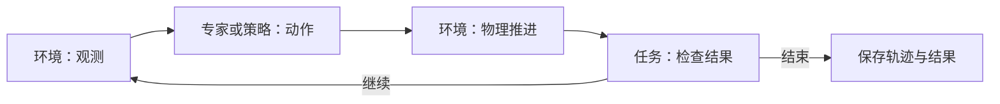

# 架构

## 原则

一份事实只定义一次；任务目标与执行方法分开；采样规则与实际初态分开；已有能力用配置组合，新行为用 Python 实现。

## 配置职责

| 部分 | 定义什么 | 当前入口 |
| --- | --- | --- |
| 资产 | 模型、物理属性、功能区域；本体关节与夹爪定义 | `assets/`、`embodiments/` |
| 场景 | 对象实例、布局、环境条件与采样范围 | `configs/scenes/` |
| 部署 | 本体选择、安装、初始姿态、控制与相机 | `configs/deployments/` |
| 任务 | 对象角色、前置条件、完成与失败判据 | `configs/tasks/`、`tasks/` |
| 组合 | 引用三份配置，绑定对象与操作臂 | `configs/collection/` |

例如[放入任务的组合配置](../configs/collection/pick_place.yaml)把任务角色 `target_object` 绑定到场景实例 `object`，把 `manipulator` 绑定到右臂。换目标只改绑定，换布局改场景，换安装改部署；新增判据或动作流程需要对应代码。

组合经采样与检查后，保存确定的配置和实际初态，形成可复现的运行案例。位姿必须注明参考坐标系；不兼容组合应说明原因，不能隐式修改其他配置。

这是目标边界。当前已有配置拆分，但通用前置条件尚未实现，本体固定参数仍部分写在部署中。

## 执行职责

Runner 协调下面的循环与记录。环境持有物理状态，专家持有动作阶段，任务检查器持有判定进度。

环境负责创建实体和重置初态；执行器只提供动作；任务判据独立于专家。数据保留输入动作、测量状态、时间戳与配置，规划成功不能代替实际任务成功。

交接任务用 `giver`／`receiver` 绑定不同操作臂。专家在重置时依据物体包围盒最长轴、USD 经仿真计算的重心以及本体夹爪尺寸，生成重心两侧的一对抓点；不读取逐物体交接标注。当前采用双 Panda 从上方夹持的单一几何规则，不含候选搜索或重抓。组装入口为它创建两个单臂规划器，专家按物理反馈依次协调两臂；任务检查器从接触与物体位姿历史判断交接，不读取专家阶段。专家的 `close()` 释放其拥有的规划器，采集入口无需知道规划器数量。专家仍实现统一 `ActionSource.reset/act`；尚未引入通用技能状态机或动作流程配置语言。

## 代码入口

以下路径相对 [`src/loom_env/`](../src/loom_env)：

| 要改什么 | 从哪里看 |
| --- | --- |
| 配置解析与协议 | `specs/config.py`、`specs/episode.py` |
| 资产、本体、布局 | `assets/`、`embodiments/`、`scenes/` |
| 物理执行与观测 | `environments/isaac_lab.py` |
| 任务判据、专家行为 | `tasks/`、`experts/` |
| 组件组装、执行循环 | `runtime/build.py`、`runtime/runner.py`；接口在 `runtime/protocols.py` |
| 轨迹读写与校验 | `data/`，可独立于仿真使用 |

命令入口在 `scripts/`，依赖在 `pyproject.toml`。随[任务与场景拓展](expansion-plan.md)按具体案例检查组装入口的角色假设和部署与本体定义的重复；进度统一见 [README](../README.md#当前进度)。
