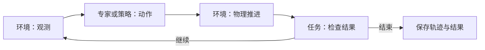
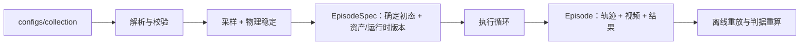

# 架构

面向 context-conditioned VLA 的机器人操作仿真与数据框架。目标是把**任务、场景、部署**三件事独立描述，组合成可运行、可复现的案例。

## 设计原则

- **一份事实只定义一次。** 依赖、配置和协议单处维护，不重复声明多套入口。
- **任务目标与执行方法分开。** 任务定义「什么算完成」，专家决定「怎么做」；任务检查器不读专家的阶段编号。
- **采样规则与实际初态分开。** 场景描述采样范围，每次运行解析出确定初态并冻结记录，重放不依赖采样。
- **已有能力用配置组合，新行为用 Python 实现。** 换对象／布局／安装不改代码；新判据或新动作流程才写代码。
- **成功判据不使用速度阈值。** 位置和接触条件连续满足 `hold_time` 即算完成；速度只作为物理状态保存供诊断。规划器和控制器自己的速度上限是执行参数，不是验收门槛。
- **不用简单方案解决未证实的问题。** 先跑通最小可行方案，新增机制必须针对已观察到的问题并有对照验证。

## 配置职责

| 部分 | 定义什么 | 入口 |
| --- | --- | --- |
| 资产 | 模型、物理属性、功能区域；本体关节与夹爪定义 | [`assets/`](../src/loom_env/assets)、[`embodiments/`](../src/loom_env/embodiments) |
| 场景 | 对象实例、布局、环境条件与采样范围 | `configs/scenes/` |
| 部署 | 本体选择、安装、初始姿态、控制与相机 | `configs/deployments/` |
| 任务 | 对象角色、指令、能力需求、判据参数 | `configs/tasks/`、[`tasks/`](../src/loom_env/tasks) |
| 组合 | 引用上面三份，绑定对象与操作臂 | `configs/collection/` |

例如[放入任务的组合](../configs/collection/pick_place.yaml)把任务角色 `target_object` 绑定到场景实例 `object`，把 `manipulator` 绑定到右臂。换目标只改绑定，换布局改场景，换安装改部署。

组合经采样与检查后保存确定的配置和实际初态，形成可复现的运行案例。位姿必须注明参考坐标系；不兼容的组合应报错，不能隐式修改其他配置。配置解析后不可变，解析期拒绝重复键、非有限数和非单位四元数。

## 执行职责



三个接口在 [`runtime/protocols.py`](../src/loom_env/runtime/protocols.py)，彼此正交，都不依赖 Isaac Lab：

```python
ActionSource:  reset(EpisodeInput) ; act(Observation) -> Action
Task:          reset(world_state)  ; update(world_state, dt) -> TaskStatus
Environment:   reset_episode(EpisodeSpec) -> Frame ; step(action) -> Transition
```

- **ActionSource** 只出动作，不判成败。动作完成只允许流程继续。
- **Task** 只判成败，不看专家的阶段。它从接触力、位姿和关节状态的历史独立判断。
- **Environment** 只做物理和观测，负责创建实体和还原初态。

`Observation`（模型可见：机器人关节、TCP、相机图像）与 `world_state`（场景真值：物体位姿、接触力、重心、被谁抓住）分开存储，`Frame` 同时持有两者。**当前专家从仿真真值读取接触和位姿，策略只读取 `Observation`**——脚本专家需要真值才能抓取，但这个边界靠约定维持，不是类型强制的。

专家与策略实现同一个 `ActionSource`，接入同一个 Runner。

## 数据流



配置解析、执行循环和轨迹读写分离：`specs/` 不依赖仿真，`data/` 可脱离仿真独立使用。数据保留输入动作、实测状态、时间戳和配置；规划成功不能代替任务成功。物理重放把记录的动作重新执行一遍，逐帧比对状态，用来验证确定性——重放通过不等于原回合任务成功。

## 代码入口

以下路径相对 [`src/loom_env/`](../src/loom_env)：

| 要改什么 | 从哪里看 |
| --- | --- |
| 配置解析与运行期数据协议 | `specs/config.py`、`specs/episode.py` |
| 资产、本体、场景采样 | `assets/`、`embodiments/`、`scenes/` |
| 物理执行与观测 | `environments/isaac_lab.py` |
| 任务判据 | `tasks/` |
| 专家行为与共享动作 | `experts/` |
| 组件组装与执行循环 | `runtime/build.py`、`runtime/runner.py`；接口在 `runtime/protocols.py` |
| 轨迹读写与校验 | `data/`，可独立于仿真使用 |
| 命令行入口 | `scripts/`，各文件第一行是用途，参数看 `--help` |

## 专家与动作

Expert 是一次完整示范的执行策略，不是一套交互能力分类。全部七个 expert（Lift、PickPlace、Insertion、Push、Sweep、Handover、Articulation）在普通 Python `routine()` 中组合反馈动作，共用 `ActionExpert.reset/act/close`。

- [`experts/actions.py`](../src/loom_env/experts/actions.py) 提供共享动作：`Move`（不要求持物的规划运动）、`MoveHeld`（已有抓持下的规划运动）、`Grasp`（接近并建立抓持）、`CloseGripper`、`Release`、`Extract`（沿给定退出轴的持物运动）。
- 任务特有的动作留在各自模块：插入的对齐与进入是 `experts/insertion.py::Insert`，接触推进是 `experts/push.py::PushContact`，关节约束运动是 `experts/articulation.py::MoveJoint`。它们可以从入口附近的已有状态独立开始。
- 每个动作持有自己的执行进度，`step(arm)` 返回是否完成，失败抛 `SourceFailure`。每个控制周期先 `update(observation, world)` 再调用当前动作的 `step(arm)`；`ActionExpert` 只推进生成器、汇总命令和事件，没有动作注册表或流程配置语言。
- 动作使用显式的 `Manipulator` 状态／命令缓冲区，每只手的规划器和操作几何分别通过 `arm.planner`、`arm.profile` 访问。

**抓持证据只来自目标物体上的实测双指接触力**，不使用夹爪开度、开度占行程比例或夹爪命令推断。双指相向接触不等于抓稳；任务还需用真实的抬升、持物和释放过程验收。

## 已知的结构性负担

这些是当前的实现事实，不是设计意图，改动前需要先讨论：

- [`environments/isaac_lab.py`](../src/loom_env/environments/isaac_lab.py) 同时承担 Isaac Lab 配置组装、观测与 recorder 管道、USD prim 内省、物理测量（`world_state` 与初态收敛）和实验元数据五件事。
- `runtime/build.py` 按专家类身份分派规划器数量和角色绑定（`if factory is HandoverExpert`），而不是由专家自己声明。
- 动作层有重复样板：握持命令的下发、`held` 守卫、以及「推进参考 → 构造目标位姿 → `cartesian_step`」的伺服循环在多处各写一遍。
- 配置变体通过复制文件表达（如 `push_short.yaml` 与 `push.yaml` 只差一个 `target_position`），而不是参数。
